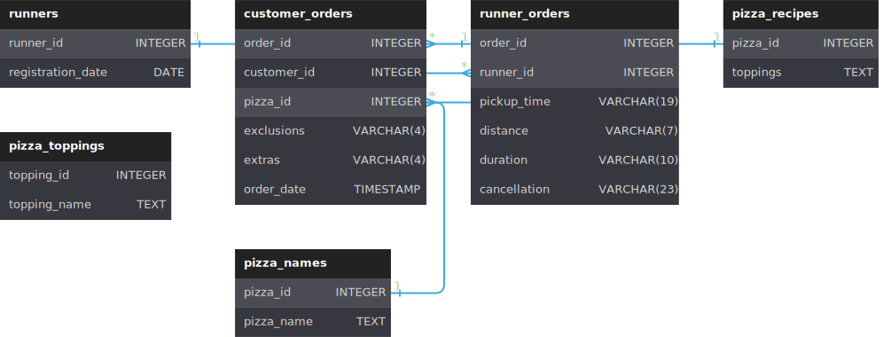

# Pizza Runner

Did you know that over 115 million kilograms of pizza is consumed daily worldwide??? (Well according to Wikipedia anyway…)

Danny was scrolling through his Instagram feed when something really caught his eye - “80s Retro Styling and Pizza Is The Future!”

Danny was sold on the idea, but he knew that pizza alone was not going to help him get seed funding to expand his new Pizza Empire - so he had one more genius idea to combine with it - he was going to Uberize it - and so Pizza Runner was launched!

Danny started by recruiting “runners” to deliver fresh pizza from Pizza Runner Headquarters (otherwise known as Danny’s house) and also maxed out his credit card to pay freelance developers to build a mobile app to accept orders from customers.

## Available Data

Because Danny had a few years of experience as a data scientist - he was very aware that data collection was going to be critical for his business’ growth.

He has prepared for us an entity relationship diagram of his database design but requires further assistance to clean his data and apply some basic calculations so he can better direct his runners and optimise Pizza Runner’s operations.

All datasets exist within the `pizza_runner` database schema - be sure to include this reference within your SQL scripts as you start exploring the data and answering the case study questions.

### Entity Relationship Diagram
Check the following diagram for a quick preview or access the interactive version at [dbdiagram.io](https://dbdiagram.io/d/5f3e085ccf48a141ff558487/):

Full DDL is available [here](https://github.com/aalekhpatel07/8-week-sql-challenge/blob/main/schema/02-pizza-runner.sql).

### Table 1: `runners`

The `runners` table shows the `registration_date` for each new runner:

<table>
  <thead>
    <tr>
      <th>runner_id</th>
      <th>registration_date</th>
    </tr>
  </thead>
  <tbody>
    <tr>
      <td>1</td>
      <td>2021-01-01</td>
    </tr>
    <tr>
      <td>2</td>
      <td>2021-01-03</td>
    </tr>
    <tr>
      <td>3</td>
      <td>2021-01-08</td>
    </tr>
    <tr>
      <td>4</td>
      <td>2021-01-15</td>
    </tr>
  </tbody>
</table>

### Table 2: `customer_orders`

Customer pizza orders are captured in the `customer_orders` table with 1 row for each individual pizza that is part of the order.

The `pizza_id` relates to the type of pizza which was ordered whilst the `exclusions` are the `ingredient_id` values which should be removed from the pizza and the extras are the `ingredient_id` values which need to be added to the pizza.

Note that customers can order multiple pizzas in a single order with varying `exclusions` and `extras` values even if the pizza is the same type!

The `exclusions` and `extras` columns will need to be cleaned up before using them in your queries.

<table>
    <thead>
      <tr>
        <th>order_id</th>
        <th>customer_id</th>
        <th>pizza_id</th>
        <th>exclusions</th>
        <th>extras</th>
        <th>order_time</th>
      </tr>
    </thead>
    <tbody>
      <tr>
        <td>1</td>
        <td>101</td>
        <td>1</td>
        <td>&nbsp;</td>
        <td>&nbsp;</td>
        <td>2021-01-01 18:05:02</td>
      </tr>
      <tr>
        <td>2</td>
        <td>101</td>
        <td>1</td>
        <td>&nbsp;</td>
        <td>&nbsp;</td>
        <td>2021-01-01 19:00:52</td>
      </tr>
      <tr>
        <td>3</td>
        <td>102</td>
        <td>1</td>
        <td>&nbsp;</td>
        <td>&nbsp;</td>
        <td>2021-01-02 23:51:23</td>
      </tr>
      <tr>
        <td>3</td>
        <td>102</td>
        <td>2</td>
        <td>&nbsp;</td>
        <td>NaN</td>
        <td>2021-01-02 23:51:23</td>
      </tr>
      <tr>
        <td>4</td>
        <td>103</td>
        <td>1</td>
        <td>4</td>
        <td>&nbsp;</td>
        <td>2021-01-04 13:23:46</td>
      </tr>
      <tr>
        <td>4</td>
        <td>103</td>
        <td>1</td>
        <td>4</td>
        <td>&nbsp;</td>
        <td>2021-01-04 13:23:46</td>
      </tr>
      <tr>
        <td>4</td>
        <td>103</td>
        <td>2</td>
        <td>4</td>
        <td>&nbsp;</td>
        <td>2021-01-04 13:23:46</td>
      </tr>
      <tr>
        <td>5</td>
        <td>104</td>
        <td>1</td>
        <td>null</td>
        <td>1</td>
        <td>2021-01-08 21:00:29</td>
      </tr>
      <tr>
        <td>6</td>
        <td>101</td>
        <td>2</td>
        <td>null</td>
        <td>null</td>
        <td>2021-01-08 21:03:13</td>
      </tr>
      <tr>
        <td>7</td>
        <td>105</td>
        <td>2</td>
        <td>null</td>
        <td>1</td>
        <td>2021-01-08 21:20:29</td>
      </tr>
      <tr>
        <td>8</td>
        <td>102</td>
        <td>1</td>
        <td>null</td>
        <td>null</td>
        <td>2021-01-09 23:54:33</td>
      </tr>
      <tr>
        <td>9</td>
        <td>103</td>
        <td>1</td>
        <td>4</td>
        <td>1, 5</td>
        <td>2021-01-10 11:22:59</td>
      </tr>
      <tr>
        <td>10</td>
        <td>104</td>
        <td>1</td>
        <td>null</td>
        <td>null</td>
        <td>2021-01-11 18:34:49</td>
      </tr>
      <tr>
        <td>10</td>
        <td>104</td>
        <td>1</td>
        <td>2, 6</td>
        <td>1, 4</td>
        <td>2021-01-11 18:34:49</td>
      </tr>
    </tbody>
  </table>

### Table 3: `runner_orders`

After each orders are received through the system - they are assigned to a runner - however not all orders are fully completed and can be cancelled by the restaurant or the customer.

The `pickup_time` is the timestamp at which the runner arrives at the Pizza Runner headquarters to pick up the freshly cooked pizzas. The `distance` and `duration` fields are related to how far and long the runner had to travel to deliver the order to the respective customer.

There are some known data issues with this table so be careful when using this in your queries - make sure to check the data types for each column in the schema SQL!

<table>
    <thead>
      <tr>
        <th>order_id</th>
        <th>runner_id</th>
        <th>pickup_time</th>
        <th>distance</th>
        <th>duration</th>
        <th>cancellation</th>
      </tr>
    </thead>
    <tbody>
      <tr>
        <td>1</td>
        <td>1</td>
        <td>2021-01-01 18:15:34</td>
        <td>20km</td>
        <td>32 minutes</td>
        <td>&nbsp;</td>
      </tr>
      <tr>
        <td>2</td>
        <td>1</td>
        <td>2021-01-01 19:10:54</td>
        <td>20km</td>
        <td>27 minutes</td>
        <td>&nbsp;</td>
      </tr>
      <tr>
        <td>3</td>
        <td>1</td>
        <td>2021-01-03 00:12:37</td>
        <td>13.4km</td>
        <td>20 mins</td>
        <td>NaN</td>
      </tr>
      <tr>
        <td>4</td>
        <td>2</td>
        <td>2021-01-04 13:53:03</td>
        <td>23.4</td>
        <td>40</td>
        <td>NaN</td>
      </tr>
      <tr>
        <td>5</td>
        <td>3</td>
        <td>2021-01-08 21:10:57</td>
        <td>10</td>
        <td>15</td>
        <td>NaN</td>
      </tr>
      <tr>
        <td>6</td>
        <td>3</td>
        <td>null</td>
        <td>null</td>
        <td>null</td>
        <td>Restaurant Cancellation</td>
      </tr>
      <tr>
        <td>7</td>
        <td>2</td>
        <td>2020-01-08 21:30:45</td>
        <td>25km</td>
        <td>25mins</td>
        <td>null</td>
      </tr>
      <tr>
        <td>8</td>
        <td>2</td>
        <td>2020-01-10 00:15:02</td>
        <td>23.4 km</td>
        <td>15 minute</td>
        <td>null</td>
      </tr>
      <tr>
        <td>9</td>
        <td>2</td>
        <td>null</td>
        <td>null</td>
        <td>null</td>
        <td>Customer Cancellation</td>
      </tr>
      <tr>
        <td>10</td>
        <td>1</td>
        <td>2020-01-11 18:50:20</td>
        <td>10km</td>
        <td>10minutes</td>
        <td>null</td>
      </tr>
    </tbody>
  </table>

### Table 4: `pizza_names`

At the moment - Pizza Runner only has 2 pizzas available the Meat Lovers or Vegetarian!

<table>
    <thead>
      <tr>
        <th>pizza_id</th>
        <th>pizza_name</th>
      </tr>
    </thead>
    <tbody>
      <tr>
        <td>1</td>
        <td>Meat Lovers</td>
      </tr>
      <tr>
        <td>2</td>
        <td>Vegetarian</td>
      </tr>
    </tbody>
  </table>

### Table 5: `pizza_recipes`

Each `pizza_id` has a standard set of `toppings` which are used as part of the pizza recipe.

<table>
    <thead>
      <tr>
        <th>pizza_id</th>
        <th>toppings</th>
      </tr>
    </thead>
    <tbody>
      <tr>
        <td>1</td>
        <td>1, 2, 3, 4, 5, 6, 8, 10</td>
      </tr>
      <tr>
        <td>2</td>
        <td>4, 6, 7, 9, 11, 12</td>
      </tr>
    </tbody>
  </table>

### Table 6: `pizza_toppings`

This table contains all of the `topping_name` values with their corresponding `topping_id` value

  <table>
    <thead>
      <tr>
        <th>pizza_id</th>
        <th>toppings</th>
      </tr>
    </thead>
    <tbody>
      <tr>
        <td>1</td>
        <td>1, 2, 3, 4, 5, 6, 8, 10</td>
      </tr>
      <tr>
        <td>2</td>
        <td>4, 6, 7, 9, 11, 12</td>
      </tr>
    </tbody>
  </table>

## Case Study Questions

This case study has LOTS of questions - they are broken up by area of focus including:

- Pizza Metrics
- Runner and Customer Experience
- Ingredient Optimisation
- Pricing and Ratings
- Bonus DML Challenges (DML = Data Manipulation Language)

Each of the following case study questions can be answered using a single SQL statement.

Again, there are many questions in this case study - please feel free to pick and choose which ones you’d like to try!

Before you start writing your SQL queries however - you might want to investigate the data, you may want to do something with some of those `null` values and data types in the `customer_orders` and `runner_orders` tables!

### E. Bonus Questions

If Danny wants to expand his range of pizzas - how would this impact the existing data design? Write an `INSERT` statement to demonstrate what would happen if a new `Supreme` pizza with all the toppings was added to the Pizza Runner menu?

#### [A. Pizza Metrics](./pizza-metrics/)
#### [B. Runner and Customer Experience](./runner-and-customer-experience/)
#### [C. Ingredient Optimization](./ingredient-optimization/)
#### [D. Pricing and Ratings](./pricing-and-ratings/)
#### [E. Bonus](./bonus/)